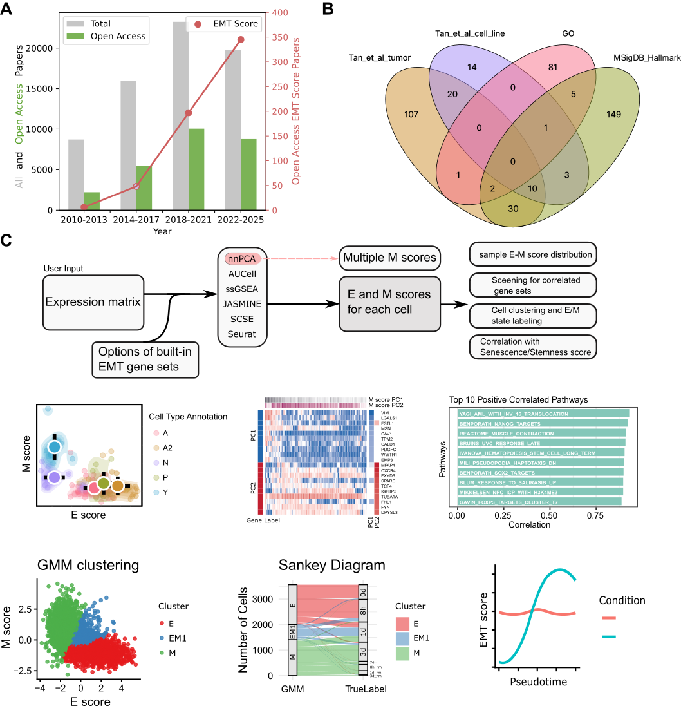

## EMTscore

An integrated R package for comprehensive quantification and analysis of 
Epithelial-Mesenchymal Transition (EMT) scores from single-cell and bulk omics data.



### Overview
Epithelial-Mesenchymal Transition (EMT) is a key cellular plasticity process involved in development, cancer progression, fibrosis, and more. Partial EMT states are increasingly recognized as critical in many biological contexts.

**EMTscore** providing a unified, flexible toolbox that:

- Integrates multiple state-of-the-art EMT scoring methods
- Allows users to choose from a curated collection of EMT gene sets
- Supports both single-cell and bulk RNA-seq data
- Offers advanced visualization and downstream analysis tools

### Key Features

- **Multiple EMT scoring methods**  
  nnPCA, AUCell, SCSE, ssGSEA, Seurat AddModuleScore, JASMINE

- **Extensive curated EMT gene sets**  
  Includes gene sets from classic EMT signatures, cancer-specific, fibrosis-related, and more

- **Unique nnPCA-based divergent EMT scoring**  
  Captures both classical and alternative EMT programs from a single dataset

- **Comprehensive downstream analyses**  
  - Sample-level E/M score distribution visualization  
  - Correlation with senescence/stemness scores  
  - Screening for correlated gene sets  
  - Cell clustering and E/M state labeling  

- **Publication-quality plots**  
  Scatter plots, heatmaps, Clustering, Sankey diagrams, Correlation plots, etc.
  
### Installation

```{r}
# Install from GitHub
if (!requireNamespace("devtools", quietly = TRUE))
    install.packages("devtools")
devtools::install_github("wenmm/EMTscore")
```

### Quick Start
[`EMTscoreData`](https://github.com/wenmm/EMTscoreData/tree/main): Provides curated EMT gene sets and reference data used by `EMTscore`
```{r}
library(EMTscoreData)
library(EMTscore)

eh = ExperimentHub()
query(eh , 'EMTscoreData')
A549_EGF <- eh[['EH10292']]
A549_TGFB1 <- eh[['EH10293']]
gmt <- system.file("extdata", "HALLMARK_EPITHELIAL_MESENCHYMAL_TRANSITION.v2025.1.Hs.gmt", package = "EMTscore")

objects <- list(
A549_TGFB1 = A549_TGFB1,
A549_EGF   = A549_EGF## EMTscore

An integrated R package for comprehensive quantification and analysis of 
Epithelial-Mesenchymal Transition (EMT) scores from single-cell and bulk omics data.


### Overview
Epithelial-Mesenchymal Transition (EMT) is a key cellular plasticity process involved in development, cancer progression, fibrosis, and more. Partial EMT states are increasingly recognized as critical in many biological contexts.

**EMTscore** providing a unified, flexible toolbox that:

- Integrates multiple state-of-the-art EMT scoring methods
- Allows users to choose from a curated collection of EMT gene sets
- Supports both single-cell and bulk RNA-seq data
- Offers advanced visualization and downstream analysis tools

### Key Features

- **Multiple EMT scoring methods**  
  nnPCA, AUCell, SCSE, ssGSEA, Seurat AddModuleScore, JASMINE

- **Extensive curated EMT gene sets**  
  Includes gene sets from classic EMT signatures, cancer-specific, fibrosis-related, and more

- **Unique nnPCA-based divergent EMT scoring**  
  Captures both classical and alternative EMT programs from a single dataset

- **Comprehensive downstream analyses**  
  - Sample-level E/M score distribution visualization  
  - Correlation with senescence/stemness scores  
  - Screening for correlated gene sets  
  - Cell clustering and E/M state labeling  

- **Publication-quality plots**  
  Scatter plots, heatmaps, Clustering, Sankey diagrams, Correlation plots, etc.
  
### Installation

#### Dependencies
The code is implemented in R and has been primarily tested on R 4.6 (development version) and Bioconductor 3.23 (development version).

```{r}
# Install from GitHub
if (!requireNamespace("devtools", quietly = TRUE))
    install.packages("devtools")
devtools::install_github("wenmm/EMTscore")
BiocManager::install("EMTscoreData")
```

### Quick Start
[`EMTscoreData`](https://github.com/wenmm/EMTscoreData/tree/main): Provides curated EMT gene sets and reference data used by `EMTscore`
```{r}
library(EMTscoreData)
library(EMTscore)

eh = ExperimentHub()
query(eh , 'EMTscoreData')
A549_EGF <- eh[['EH10292']]
A549_TGFB1 <- eh[['EH10293']]
gmt <- system.file("extdata", "HALLMARK_EPITHELIAL_MESENCHYMAL_TRANSITION.v2025.1.Hs.gmt", package = "EMTscore")

objects <- list(
A549_TGFB1 = A549_TGFB1,
A549_EGF   = A549_EGF
)

seurat_objs <- add_EMT_score(objects, gmt_file = gmt, emt_name = "EMT_score", method = "nnPCA",nnPCA_dim = 1)
p_nnPCA <- plot_EMT_from_objects(seurat_objs, col_name = "Pseudotime", emt_score_col = "EMT_score")
p_nnPCA
```

### Documentation
Full documentation and vignettes are available in the package:
```{r}
vignette("EMTscore")
```
The documentation includes <a href="https://emtscore.w3spaces.com/"> a notebook also available here </a>.

### Feedback & Contributions
Please submit issues or pull requests on GitHub:
https://github.com/wenmm/EMTscore
We welcome contributions to expand the gene sets, scoring methods, and visualization options!

)

seurat_objs <- add_EMT_score(objects, gmt_file = gmt, emt_name = "EMT_score", method = "nnPCA",nnPCA_dim = 1)
p_nnPCA <- plot_EMT_from_objects(seurat_objs, col_name = "Pseudotime", emt_score_col = "EMT_score")
p_nnPCA
```

### Documentation
Full documentation and vignettes are available in the package:
```{r}
vignette("EMTscore")
```

### Feedback & Contributions
Please submit issues or pull requests on GitHub:
https://github.com/wenmm/EMTscore
We welcome contributions to expand the gene sets, scoring methods, and visualization options!